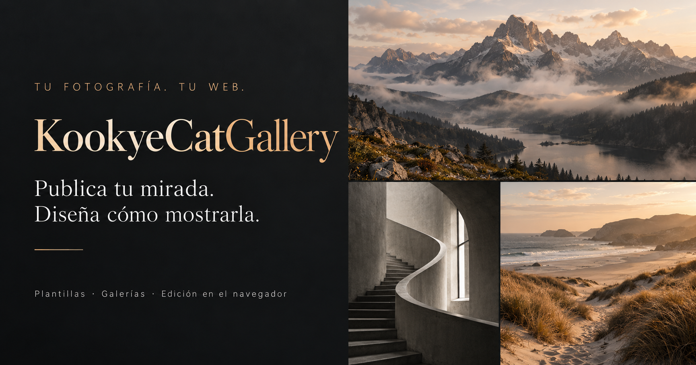

<p align="center">
  
</p>

<h1 align="center">KookyeCatGallery</h1>

<p align="center">
  <strong>Tu fotografía. Tu web.</strong><br>
  Una galería autoalojada para fotógrafos que quieren crear su web,<br>
  subir imágenes fácilmente y elegir cómo presentar su trabajo.<br>
  Personaliza tu portfolio y gestiona tus fotografías desde el navegador.
</p>

<p align="center">
  <a href="LICENSE"></a>
  <a href="manifest.json"></a>
  <a href="#plantillas-y-modos-de-presentación"></a>
</p>

<p align="center">
  <a href="#requisitos"></a>
  <a href="#tecnología"></a>
  <a href="#tecnología"></a>
</p>

<h3 align="center"><a href="#instalación">📷 Crear tu web con KookyeCatGallery</a></h3>

<p align="center">
  <a href="#plantillas-y-modos-de-presentación">Plantillas y presentación</a> ·
  <a href="#instalación">Instalación</a> ·
  <a href="docs/subida-fotografias.md">Subir fotografías</a> ·
  <a href="docs/filtros-fotograficos.md">Editor y filtros</a> ·
  <a href="CONTRIBUTING.md">Contribuir</a>
</p>

---

## Características

- **Tu portfolio en tu servidor:** presenta paisajes, retratos, arquitectura, fotografía de calle o cualquier otra especialidad con tu identidad y tus textos.
- **Subida desde el navegador:** incorpora imágenes desde el panel de administración y organiza categorías, títulos, metadatos, borradores, orden y favoritos.
- **Diseño configurable:** combina cabeceras, paletas y modos de galería, con ajustes independientes para móvil y escritorio.
- **Editor integrado:** aplica filtros y ajustes fotográficos desde el navegador antes de publicar.
- **Visor de fotografías:** navegación táctil, fotografía completa y modo de pantalla completa.
- **Personalización del sitio:** edita perfil, logo, enlaces sociales, textos, proyecto y páginas legales desde el panel.
- **PWA instalable:** diseño adaptable, soporte básico sin conexión y generación de imágenes WebP.
- **Mapa opcional:** desactivado inicialmente; actívalo si quieres mostrar las ubicaciones de tus fotografías.

Guías: [textos y diseño](docs/textos-y-diseno.md) · [filtros fotográficos](docs/filtros-fotograficos.md) · [navegación entre fotos](docs/navegacion-fotografias.md) · [subida de fotografías](docs/subida-fotografias.md).

## Plantillas y modos de presentación

Desde **Textos y diseño** puedes combinar las opciones del sitio sin editar código. La cabecera, el modo de galería y el número de columnas se eligen por separado para móvil y escritorio.

### Cabeceras para dar personalidad a tu web

| Móvil · 9 diseños | Escritorio · 9 diseños |
| --- | --- |
| Perfil social | Tipográfica |
| Retrato centrado | Retrato centrado |
| Compacta | Compacta |
| Editorial | Editorial |
| Cine · tira de película | Museo · galería blanca |
| Atlas · cuaderno cartográfico | Observatorio · constelación 3D |
| Estudio · retícula suiza | Periódico · portada de autor |
| Órbita · cielo 3D | Noir · estreno de cine |
| Álbum · recortes y postales | Plano · archivo técnico |

### Diez formas de mostrar tus fotografías

Todos los modos están disponibles tanto en móvil como en escritorio.

| Modo | Presentación |
| --- | --- |
| **Masonry** | Columnas con alturas naturales que conservan las proporciones de cada fotografía. |
| **Cuadrícula** | Miniaturas uniformes con proporción cuadrada, horizontal 4:3 o vertical 3:4. |
| **Mosaico cromático** | Filas ajustadas que mantienen las proporciones originales y comparten sus bordes. |
| **Editorial asimétrica** | Filas de distinta densidad para una composición editorial. |
| **Filas por categoría** | Fotografías agrupadas en tiras por categoría. |
| **Álbum desordenado** | Composición de imágenes cuadradas de distintos tamaños, con una ligera inclinación. |
| **Sala de exposición** | Fotografías grandes y centradas, con espacio entre ellas. |
| **Hoja de contactos** | Una vista compacta para recorrer una colección de imágenes. |
| **Secuencia narrativa** | Una imagen protagonista seguida de una secuencia de fotografías. |
| **Trípticos** | Composiciones de tres imágenes: una grande junto a dos más pequeñas. |

### Galerías premium

Diseños completos que **sustituyen** a la galería estándar. Se eligen en **Textos y diseño → Diseño → Galería premium**; al activar una se ignoran (y se desactivan en el panel) los ajustes de la galería estándar que ella no use: el tipo de cuadrícula, las galerías de móvil y de escritorio, la forma de la paginación, las columnas y, salvo en «Estilo Burbujas» y «Estilo Cuadrados», las fotos visibles a la vez. Se integran con la paleta de colores y con las cabeceras.

| Galería premium | Presentación |
| --- | --- |
| **Estilo Baraja** | Pantalla completa (100 % de ancho y alto en cualquier dispositivo). Las fotos son cartas apiladas en 3D: al avanzar —rueda del ratón hacia abajo o dedo hacia arriba— la carta sale hacia la izquierda, se encoge y se desvanece, dejando ver el mazo. La página de fondo no se mueve y, en la primera y última foto, el gesto vuelve a desplazar la página. |
| **Estilo Burbujas** | Pantalla completa. Las fotos son círculos de distintos tamaños con un pequeño marco, repartidos al azar por toda la pantalla (sin solaparse ni salirse) y flotando lentamente, sin texto. Respeta «Fotos visibles a la vez» y se pagina con una paginación minimalista («1 / 7»). Al pulsar un círculo rebota y se abre su ficha. Comparte con la baraja la fijación en móvil, la parada del scroll, los botones de salir, los filtros y la vuelta a la misma foto. |
| **Estilo Cuadrados** | Igual que «Estilo Burbujas» (mismo marcado, estilos y comportamiento), pero con cuadrados de distintos tamaños en lugar de círculos. |
| **Estilo Tambor** | Pantalla completa. Carrusel cilíndrico 3D: las fotos giran como un tambor, con la activa de frente y las vecinas curvadas hacia atrás a ambos lados. Misma interfaz y comportamiento que «Estilo Baraja» (rueda, dedo, teclado, botones de salir, fijación en móvil, filtros y vuelta a la misma foto). |
| **Estilo Cilindro** | Variación del tambor: varias filas de fotos de distintos tamaños forman un cilindro giratorio que ocupa todo el ancho de la pantalla (en escritorio, estirado hacia los bordes). Misma interfaz y comportamiento que «Estilo Baraja». |
| **Estilo Polaroids** | Polaroids esparcidas sobre una mesa: la activa se centra y se amplía y las demás quedan alrededor, giradas y algo desenfocadas. Misma interfaz y comportamiento que «Estilo Baraja». |
| **Estilo Tinder** | Una carta que se desliza a un lado: hacia el **corazón** (derecha) da un corazón a la foto y pasa a la siguiente; hacia la **flecha** (izquierda) solo pasa. En los dos casos avanza, y la interfaz lo indica con un corazón y una flecha. |

Todos los detalles (comportamiento, ajustes de la animación, arquitectura y cómo crear una galería premium nueva) están en [docs/galerias-premium.md](docs/galerias-premium.md).

### Color, proporciones y efectos

- **7 paletas:** Elegante, Noche, Luz, Cyberpunk, Japón, Bosque y Océano.
- **5 opciones de proporción:** adaptativa, masonry, cuadrada, horizontal 4:3 y vertical 3:4. La cuadrícula usa las proporciones fijas; masonry conserva las originales. El visor abre la fotografía completa.
- **Columnas:** de 1 a 4 en móvil y de 1 a 10 en escritorio, respetando la composición de cada modo.
- **10 efectos:** Suave, Acercamiento, Elevación, Revelado, Virado de color, Marco luminoso, Desplazamiento, Perspectiva, Enfoque y Destello.

Las opciones documentadas corresponden al catálogo de [diseños del sitio](inc/site-settings.php) y al motor de [composición de galerías](assets/js/gallery-layout.js).

## Tecnología

PHP 8.1+, JavaScript, HTML y CSS. No necesita framework ni proceso de compilación. La galería se ejecuta en tu propio servidor; las fotografías y la configuración pertenecen a tu instalación y no forman parte de este repositorio.

## Requisitos

KookyeCatGallery necesita ejecutar PHP y escribir archivos en el servidor; **no funciona en un hosting estático** (por ejemplo, solo HTML/CSS/JS).

- PHP 8.1 o posterior, con **GD** compilado con soporte para JPEG, PNG y WebP, y la extensión **Fileinfo**.
- HTTPS habilitado para el dominio. El acceso de administración usa cookies seguras.
- Una raíz web para el dominio o subdominio y permisos para que PHP escriba en las carpetas de fotos y datos.
- Apache con `.htaccess` permitido, o Nginx configurado con las reglas equivalentes que se muestran más abajo.
- Posibilidad de definir variables de entorno para PHP. Si el hosting no ofrece esa opción, puedes editar los valores predeterminados de la configuración en el código; no subas contraseñas ni claves al repositorio.
- Node.js y Playwright solo son necesarios para ejecutar las comprobaciones de interfaz; no hacen falta para publicar la web.

Antes de contratar o elegir un plan, confirma con el proveedor que ofrece PHP 8.1+, GD con WebP, Fileinfo, HTTPS y permisos de escritura. No todos los hostings, incluso los que anuncian soporte PHP, incluyen estas funciones o permiten ajustar las reglas del servidor.

## Instalación

La aplicación no requiere base de datos, framework, Composer, npm ni compilación. Instálala en la raíz pública de un **dominio o subdominio** (por ejemplo, `https://fotos.ejemplo.com/`). Las rutas de la web parten de la raíz, por lo que no está preparada para instalarse en una subcarpeta como `ejemplo.com/galeria/` sin adaptar el código.

1. **Prepara el hosting.** Crea el dominio o subdominio, activa HTTPS y selecciona PHP 8.1 o posterior. Comprueba que GD tiene soporte JPEG, PNG y WebP y que Fileinfo está activa.
2. **Sube el proyecto.** Descarga el repositorio y coloca su contenido en la raíz pública asignada al dominio (a menudo llamada `public_html`, `htdocs` o `www`). No publiques el proyecto dentro de otra carpeta salvo que adaptes sus rutas.
3. **Configura el servidor web.**
   - En Apache, conserva el archivo `.htaccess` incluido y asegúrate de que el hosting permite sus reglas y el fallback a `index.php` (por ejemplo, `AllowOverride All`).
   - En Nginx no se lee `.htaccess`. Configura el bloque de servidor para usar el controlador frontal y bloquear los directorios protegidos. Como punto de partida para integrar en la configuración existente:
   
     ```nginx
     location / {
         try_files $uri $uri/ /index.php?$query_string;
     }

     location ~ ^/(var|data|img)(/|$) {
         deny all;
     }

     location ~ /.(?!well-known) {
         deny all;
     }
     ```
   
     Mantén también la configuración PHP-FPM que ya usa tu servidor. Si no tienes acceso a la configuración de Nginx, pide al proveedor que aplique estas reglas; subir `.htaccess` no las sustituye.
4. **Configura la URL pública.** Define `GALLERY_PUBLIC_URL` con la URL HTTPS completa, por ejemplo `https://fotos.ejemplo.com`. Usa el panel de variables de entorno del hosting o la configuración del pool PHP-FPM. Algunos hostings Apache permiten `SetEnv` en `.htaccess`, pero solo si el proveedor lo admite. La aplicación no lee archivos `.env` automáticamente.
5. **Elige dónde guardar los datos privados.** Recomendado: crea un directorio fuera de la raíz pública (por ejemplo, si el sitio vive en `/home/usuario/public_html`, usa `/home/usuario/galeria-privada`) y define `GALLERY_PRIVATE_DIR` con esa ruta absoluta. PHP debe poder leer y escribir allí. La aplicación crea los archivos de ajustes y acceso dentro de esa carpeta. Si el hosting no permite configurar esta variable, puede usar `var/` dentro del proyecto; Apache la protege con `.htaccess`, pero en Nginx debes bloquearla como en el ejemplo anterior.
6. **Da permiso de escritura a PHP** para `img/`, `imagenes/`, `data/` y al directorio privado configurado. Usa el gestor de archivos o la ayuda del hosting para asignar el propietario y permisos mínimos necesarios. No hagas escribible por todo el mundo el sitio completo.
7. **Ajusta el límite de subida de PHP.** Para admitir las imágenes previstas, configura `upload_max_filesize` en al menos `16M` y `post_max_size` en al menos `20M` (además de un límite de petición/tiempo adecuado si el proveedor lo impone).
8. **Configura el único usuario administrador.** No existe una cuenta ni contraseña predeterminadas. En el primer despliegue, utiliza el procedimiento de [recuperación o configuración del acceso](#recuperar-o-cambiar-el-acceso-de-administración), siguiendo su advertencia de seguridad: el archivo recuperador debe estar publicado solo mientras lo usas y debes confirmar que se ha borrado del servidor al terminar. Luego inicia sesión en `/admin.php` y personaliza el sitio.
9. **Completa el contenido antes de abrir la web.** Sube fotos desde el panel, revisa títulos y metadatos (incluidas coordenadas EXIF), y completa las páginas legales con información correcta para tu instalación.
10. **Comprueba el despliegue** abriendo la portada, una foto, el panel y una imagen WebP procesada. Si la web devuelve errores 500, revisa los registros PHP del hosting; si las fotos no se procesan, confirma las extensiones y permisos indicados.

Haz copias de seguridad de las fotografías y de los datos privados. La aplicación no usa base de datos: para migrarla, copia el código, las carpetas de imágenes y los archivos del directorio privado, y actualiza `GALLERY_PUBLIC_URL` si cambia el dominio.

Para una prueba local:

```sh
php -S 127.0.0.1:8000
```

Abre `http://127.0.0.1:8000`. El servidor PHP integrado es solo para desarrollo; no aplica las reglas de `.htaccess` ni equivale a una instalación de producción segura.

## Configuración privada

Guarda los archivos de configuración **fuera de la raíz pública del sitio web**. Crea un directorio que PHP pueda leer y escribir, y configura `GALLERY_PRIVATE_DIR` para que apunte a él. Por ejemplo, si la raíz pública es `/srv/www/galeria/public`, puedes guardar los datos privados en `/srv/www/galeria/privado`.

En ese directorio la aplicación crea `site-settings.json`, `upload-auth.php` y `hearts.json`. No subas estos archivos a GitHub ni los coloques en una carpeta que el servidor pueda servir públicamente.

Como alternativa, la aplicación puede usar `var/` dentro del proyecto. El `.htaccess` incluido bloquea el acceso web directo a esa carpeta; aun así, se recomienda configurar un directorio privado fuera de la raíz pública.

No guardes credenciales, claves API, datos de acceso ni fotos privadas en el repositorio. Las imágenes pueden contener coordenadas GPS u otros datos EXIF: revísalas antes de subirlas. El mapa está desactivado inicialmente.

## Recuperar o cambiar el acceso de administración

> ## ⛔ ADVERTENCIA DE SEGURIDAD: ESTE ARCHIVO ABRE EL PANEL A CUALQUIERA
>
> **No subas ni dejes `reset-admin-access.php` en el servidor salvo durante el instante en que vayas a configurar o recuperar el acceso.** Mientras el archivo esté publicado, el formulario es público: **cualquier visitante puede elegir un usuario y una contraseña y tomar el control del panel**. No pide la contraseña anterior ni una clave adicional. El nombre del archivo es conocido porque esta guía y el repositorio son públicos.
>
> **El borrado automático no evita que otra persona lo use primero.** Sube el archivo solo cuando estés preparado para completar el formulario inmediatamente. Al terminar, confirma desde el gestor de archivos que ha desaparecido de la raíz pública. Si aún está allí, **elimínalo manualmente antes de abandonar la sesión de alojamiento**.

El panel tiene **un solo usuario**. Para configurarlo por primera vez o reemplazar credenciales perdidas:

1. Copia `reset-admin-access.php.example` y llámalo `reset-admin-access.php`.
2. Cuando estés listo para usarlo, súbelo a la raíz pública del sitio desde el gestor de archivos o SFTP.
3. Abre `https://tu-dominio/reset-admin-access.php`, escribe el nuevo usuario y una contraseña única de al menos 12 caracteres y guarda.
4. Verifica inmediatamente que `reset-admin-access.php` ya no existe en el servidor. El script intenta borrarse al guardar; si no lo consigue, bórralo manualmente en ese momento.

Al guardar, reemplaza `upload-auth.php` dentro de `GALLERY_PRIVATE_DIR` (o de `var/` si no has configurado esa variable). La contraseña se guarda con un hash seguro. El archivo `.example` del repositorio no es el recuperador activo; solo se vuelve ejecutable después de copiarlo y subirlo con el nombre `reset-admin-access.php`. **Nunca guardes la copia PHP activa ni credenciales en GitHub y nunca mantengas el recuperador online para usarlo “más tarde”.**

## Textos con IA

La generación opcional de títulos y descripciones está disponible con Gemini u OpenRouter. Viene desactivada y sin claves. Consulta [configuración de IA](docs/ia-textos.md) para activarla mediante variables de entorno fuera del repositorio.

## Desarrollo y comprobaciones

GitHub Actions valida PHP y JavaScript y comprueba filtros, diseño adaptable, cuadrículas, administración, navegación, favoritos y editor fotográfico.

Comprobaciones básicas locales:

```sh
node tests/photo-presets.cjs
php tests/site-settings.php
php tests/photo-navigation.php
```

Con Playwright y Chromium: `node tests/premium-deck.cjs` (galería premium Estilo Baraja), `node tests/admin-layout.cjs` (panel), `node tests/gallery-layout.cjs` (galerías estándar) y el resto de `tests/*.cjs`.

Para las comprobaciones de interfaz se necesitan Playwright y Chromium. Consulta el flujo de [validación automática](.github/workflows/validate.yml).

## Contribuir y seguridad

Lee la guía para [contribuir](CONTRIBUTING.md) y las instrucciones de [seguridad](SECURITY.md).

## Licencia

El proyecto se distribuye bajo la **[PolyForm Noncommercial License 1.0.0](https://polyformproject.org/licenses/noncommercial/1.0.0)**. El texto oficial completo está en [LICENSE](LICENSE). Esta licencia oficial para software establece los usos no comerciales permitidos; consulta sus términos completos antes de reutilizar o redistribuir el proyecto.
